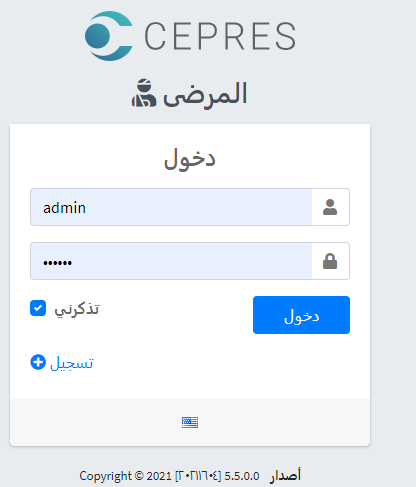
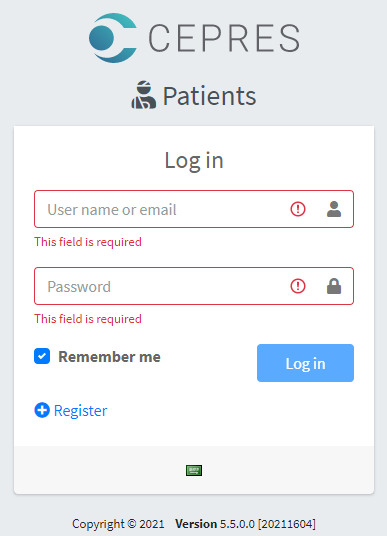

# Introduction
This is a technical task created for Cepres using **ASP.NET Core with Angular 11** startup template [ASP.NET Boilerplate](https://aspnetboilerplate.com/Pages/Documents).
User Interface is based on [AdminLTE theme](https://github.com/ColorlibHQ/AdminLTE).
# Run the Solution
## 1. Back-end
1. update-database from package manager console by select Default Project: Cepres.Patients.EntityFrameworkCore and set Startup Project: Cepres.Patients.Web.Host
2. Build & Run, the seeding builder/stratgy will add 500 random patients with their visits
## 2. Front-end
1. Yarn or npm Install in angular folder
2. npm start
3. [Login](http://localhost:4200/) as admin : 123qwe
# Design
 It is based on Domain-Driven-Design, .NET 5, EF Core, **OData V4** Protocol the standard & best way to create a fully CRUD RESTful API with all of query options supported ex: sorting, filtering, paging, grouping, multiple query options and advanced search server-side.

# Project Files
Project|File|Action
--|--|--
Core|PatientsAuthorizationProvider|Edit
Core|PermissionChecker|Edit
Core|Patients.xml|Edit
Core|Patients-ar.xml|Add
Core|Patient|Add
Core|Visit|Add
Core|PatientStatistics|Add
Core|PatientManager|Add
Core|DateInPastAttribute|Add
Core|Accord.Math, Nuget Package|Add
Application|ReportingAppService|Add
EF.Core|PatientsDbContext|Edit
EF.Core|PatientsBuilder|Add
EF.Core|SeedHelper|Edit
EF.Core|Add_Patient Migration|Add
Web.Core|ODataEntityController|Add
Web.Core|PatientController|Add
Web.Core|VisitController|Add
Web.Core|OData Core, Nuget Package|Add
Web.Host|Startup|Edit
Tests|OData Service Client|Add
Tests|OData_Tests|Add
Angular|PatientsComponent|Add
Angular|Syncfusion Grid, NPM Package|Add
Angular|Routing, Menu items|Edit
# Technical Tasks

#|Task|Time
--|--|--
1|Create & setup Solutions back & front-end|1 h
2|Create entites & code first migration|1 h
3|Create seed stratgy to cover all test cases|1 h
4|Implement Client & Server-Side validations|1 h
5|Implement "Domain Service"|1 h
6|Implement Statistics Reporting "Application Service"|1 h 
7|Implement OData-API controllers "Distributed Service"|1 h
8|Create Authorization Permissions|1 h
9|Create Localization Keys|1 h
10|Implement Patients NG Component & routing|1 h
11|Implement Patient Statistics Modal Componet|1 h
12|Create, configure Syncfusion Patients grid|2 h
13|Create, configure Syncfusion Patient Visits grid|2 h
14|Properties Client-Side Formatting|1 h
15|Test|2 h
16|Push to GitHub repo with Screenshots|1 h
17|Document|1 h
#|**TOTAL**|**20 h**

# Screenshots

## Login Page Arabic

## Login Page English

## Roles and Premissions Page

## Patients with Visits Grid

## Patient Statistics Modal 

