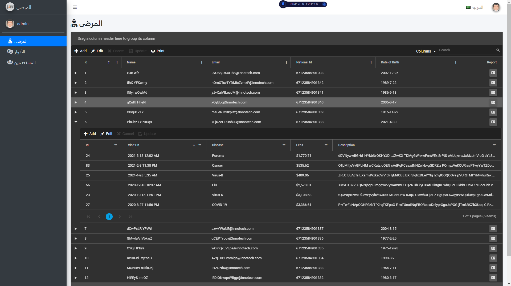
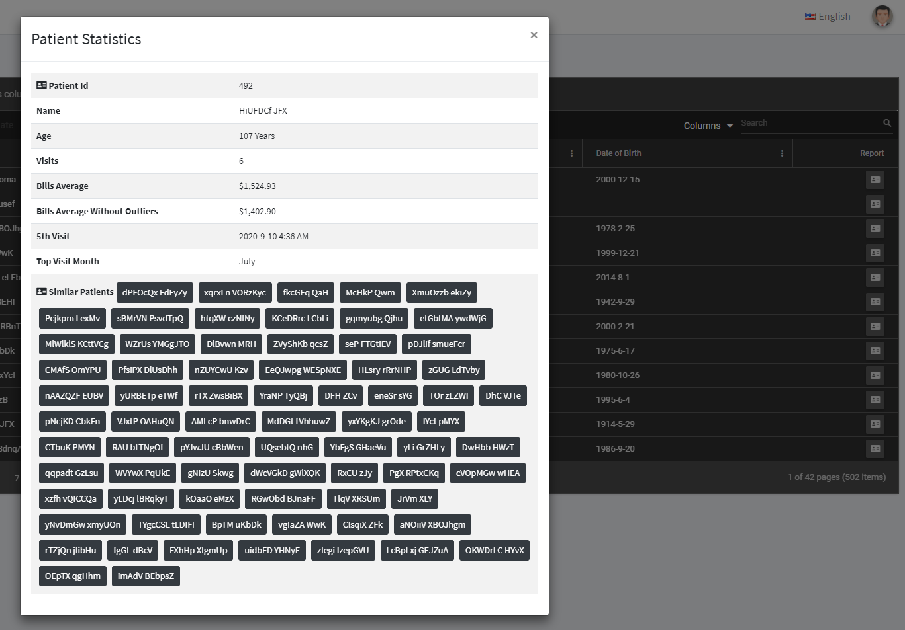

# Introduction
This is a technical assessment created for Cepres using **ASP.NET Core with Angular 11** startup template [ASP.NET Boilerplate](https://aspnetboilerplate.com/Pages/Documents).
User Interface is based on [AdminLTE theme](https://github.com/ColorlibHQ/AdminLTE).

# Design
 It is based on Domain-Driven-Design, .NET 5, EF Core, **OData V4** Protocol the standard & best way to create a fully CRUD RESTful API with all of query options supported ex: sorting, filtering, paging, grouping, multiple query options and advanced search server-side.

# Technical Tasks
#|Task|Time
--|--|--
1|Create & setup Solutions back & fron end|2 h
2|Create entites & code first migration|1 h
3|Create seed stratgy to cover all test cases|2 h
4|Implement Client & Server-Side validations|1 h
5|Implement "Domain Service"|1 h
6|Implement Statistics Reporting "Application Service"|1 h 
7|Implement OData-API controllers "Distributed Service"|1 h
8|Create Authorization Permissions|1 h
9|Create Localization Keys|1 h
10|Implement Patients NG Component & routing|1 h
11|Implement Patient Statistics Modal Componet|1 h
12|Create, configure Syncfusion Patients grid|2 h
13|Create, configure Syncfusion Patient Visits grid|2 h
14|Properties Client-Side Formatting|1 h
15|Test|2 h
16|Create & push to GitHub repo|1 h
17|Document|1 h
#|**TOTAL**|**22 h**

# Screenshots

#### Roles and Premissions Page

#### Patients with Visits Grid

#### Patient Statistics Modal 

